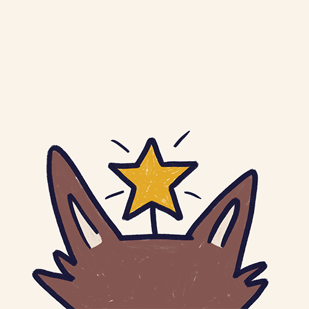

<p align="center">
  
</p>

<h3 align="center">More Wordle</h3>

<p align="center">
  Customizable Wordle app for my friends and family<br>
  <a href="https://ostern.netlify.app"><strong>Explore the demo »</strong></a>
</p>

<br>

# More Wordle

A forked, refactored and extended Vue app of [VVordle](https://github.com/yyx990803/vue-wordle) by Evan You, which itself is a implementation of the original [Wordle game](https://www.nytimes.com/games/wordle/index.html).

## Key Features

- 💆‍♀️ Easy customization
- ⌨️ Optional umlauts keyboard layout

## Make Your Own Wordle

### Base64

You can make your own Wordle and send it to friends by base64-encoding a word and include it as the URL query, e.g. [`ostern.netlify.app/?anVsaWE=`](https://ostern.netlify.app/?anVsaWE=). This will also allow words that are not in the dictionary.

### Custom Word List Via `.env`

Alternatively, you can add a custom word list to pick from to your loccal `.env` file and set a start date as well:

```dotenv
VITE_ANSWERS=first,scond,third
VITE_STARTS_AT=2022-04-01
```

More Wordle will calculate the difference between the current date and the start date and pick the answer at the array index based from the date difference.

## Prerequisites

Before getting started, please make sure you have installed the recommended setup.

- **Node.js**<sup>\*</sup> (v16, the latest LTS version) 👉 [[Download](https://nodejs.org/en/download/)]
- **pnpm**<sup>\*</sup> (the fast and disk space efficient package manager) 👉 [[Download](https://pnpm.io/installation#nodejs-is-preinstalled)]
- **Visual Studio Code** 👉 [[Download](https://code.visualstudio.com/)]
- **Volar Extension** 👉 [[Download](https://marketplace.visualstudio.com/items?itemName=johnsoncodehk.volar)]
  - Either enable [**Take Over Mode**](https://github.com/johnsoncodehk/volar/discussions/471) (recommended)
  - ... or add **TypeScript Vue Plugin (Volar)** 👉 [[Download](https://marketplace.visualstudio.com/items?itemName=johnsoncodehk.vscode-typescript-vue-plugin)]

## Installation

Install the necessary Node.js dependencies with:

```bash
pnpm install
```

## License

[MIT](./LICENSE) License © 2022 [Johann Schopplich](https://github.com/johannschopplich)

[MIT](./LICENSE) License © 2022 [Evan You](https://github.com/yyx990803)

The original creator(s) of Wordle own all applicable rights to the game itself.
